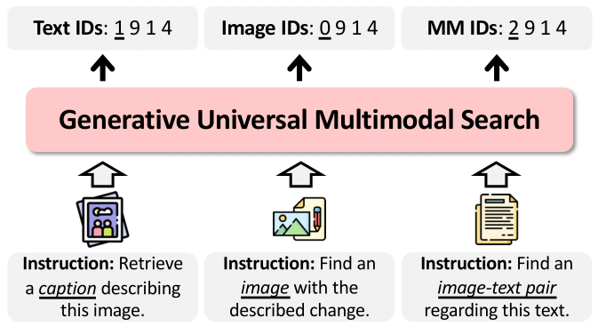
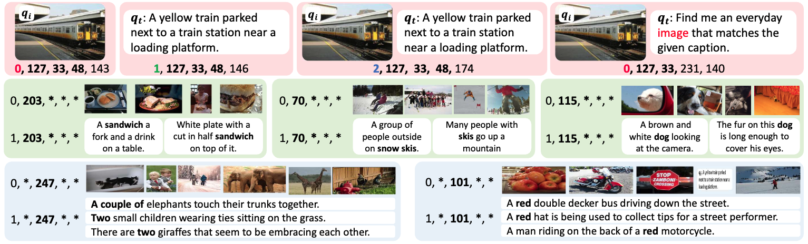
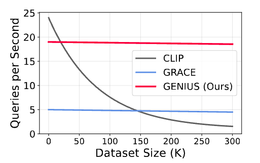

# GENIUS

This repo contains the codebase for the CVPR 2025 paper "[GENIUS: A Generative Framework for Universal Multimodal Search](https://arxiv.org/pdf/2503.19868)"


<div align="center" style="line-height: 1;">
  <a href="https://arxiv.org/pdf/2503.19868" target="_blank" style="margin: 2px;">
    
  </a>
  <a href="https://sung-yeon-kim.github.io/project_pages/GENIUS/index.html" target="_blank" style="margin: 2px;">
    
  </a>
  <a href="https://github.com/sung-yeon-kim/GENIUS" target="_blank" style="margin: 2px;">
    
  </a>
</div>

## Introduction

We propose **GENIUS**, a **universal generative retrieval framework** that supports diverse tasks across multiple modalities. By learning discrete, modality‐decoupled IDs via **semantic quantization**, GENIUS encodes multimodal data into compact identifiers and performs constant‐time retrieval with competitive accuracy. 

<p align="center">
  
</p>

### ✨ Key Advantages

- **Universal Retrieval**  
  Single model handles various retrieval tasks including image‐to‐image, text‐to‐text, image‐to‐text, text‐to‐image, and their combinations.

- **Fast Retrieval**  
  Constant‐time lookup via discrete ID matching, independent of candidate pool size.

- **Competitive Accuracy**  
  Comparable to—and sometimes better than—embedding‐based methods, while significatnly reducing inference cost.

## Overview

GENIUS consists of three key components that work together in a three-stage training pipeline:

1. **Multimodal Encoder (CLIP-SF)**  
   Extracts joint image/text features using a shared backbone. We leverage **UniIR's score‐fusion CLIP model** to learn cross‐modal relations without extra pretraining, with pretrained checkpoints available on [Hugging Face](https://huggingface.co/TIGER-Lab/UniIR).

2. **Modality-Decoupled Quantizer**  
   Compresses continuous embeddings into discrete, layered ID codes including modality and semantic information. Through **residual quantization training**, it learns to encode both images and text into layered, discrete IDs:  
   - First code: **modality indicator** (0 = image, 1 = text, 2 = image‐text)  
   - Subsequent codes: **semantic features** (objects → attributes → context)

<p align="center">
  
</p>

3. **ID Generator**  
   **Sequence‐to‐sequence decoder** that generates target IDs based on query embeddings. During training, it learns to predict discrete IDs from various input queries (images, text, or pairs with instruction). We employ **query augmentation** (query-target mixing) to improve generalization and incorporate **constrained beam search** during decoding to enforce valid ID sequences.

---

## Installation

Clone the repository and create the Conda environment:

```bash
git clone https://github.com/sung-yeon-kim/GENIUS.git
cd GENIUS
conda env create -f genius_env.yml
```


## Usage

### Download Pretrained CLIP-SF (Stage 0)

We utilize UniIR's score fusion model as a replacement for the encoder pretraining stage.

```bash
mkdir -p checkpoint/CLIP_SF
wget https://huggingface.co/TIGER-Lab/UniIR/resolve/main/checkpoint/CLIP_SF/clip_sf_large.pth -O checkpoint/CLIP_SF/clip_sf_large.pth
```


### Feature Extraction (Preprocessing)


#### - Training Data

Extracts CLIP features for training set → `extracted_embed/CLIP_SF/train`.

```bash
# Navigate to feature extraction directory
cd feature_extraction

# Run feature extraction for training data
bash run_feature_extraction_train.sh
```

#### - Candidate Pool

Extracts CLIP features for the retrieval candidate pool → `extracted_embed/CLIP_SF/cand`.

```bash
# Run feature extraction for candidate pool
bash run_feature_extraction_cand.sh
```

### Residual Quantization (Stage 1)

```bash
cd models/residual_quantization
vim configs_scripts/large/train/inbatch/inbatch.yaml  # Edit config like data path, batch size, etc.
bash configs_scripts/large/train/inbatch/run_inbatch.sh
```

### Generator Training (Stage 2)

```bash
cd models/generative_retriever
vim configs_scripts/large/train/inbatch/inbatch.yaml  # Edit config like data path, batch size, etc.
bash configs_scripts/large/train/inbatch/run_inbatch.sh
```

### Inference

1. Extract CLIP features for candidate pool (if not already done):
```bash
cd feature_extraction
bash run_feature_extraction_cand.sh
```

2. Compile trie_cpp (recommended for faster inference):
```bash
cd models/generative_retriever/trie_cpp
c++ -O3 -Wall -shared -std=c++17 -fPIC \
    $(python3 -m pybind11 --includes) \
    trie_cpp.cpp -o trie_cpp$(python3-config --extension-suffix)
```

3. Run evaluation:
```bash
cd models/generative_retriever
bash configs_scripts/large/eval/inbatch/run_eval.sh
```
> For inference, you can choose between three trie implementations: `trie_cpp` (fastest), `trie` (Python), `marisa` (alternative).


## 📈 Performance

GENIUS achieves strong performance across multiple benchmarks:

> The results in parentheses denote scores from our reimplemented checkpoints, as the originals were lost during server migration. While close to the paper, slight variations may occur due to retraining randomness.

### Task-specific Information Retrieval

| Task | Dataset | CLIP_SF | BLIP_FF | IRGen | GRACE | GENIUS (checkpoint) | GENIUSᴿ (checkpoint) |
|:-----|:--------|:-------:|:-------:|:-----:|:-----:|:-------------------:|:-------------------:|
| **T→I** | VisualNews | 42.6 | 23.4 | — | — | 18.5 (18.6) | 27.4 |
| | COCO | 81.1 | 79.7 | 50.7 | 39.5 | 68.1 (66.0) | 78.0 |
| | Fashion200K | 18.0 | 26.1 | — | — | 13.7 (14.0) | 16.2 |
| **T→T** | WebQA | 84.7 | 80.0 | — | — | 32.5 (32.6) | 44.6 |
| **T→(I,T)** | EDIS | 59.4 | 50.9 | — | — | 37.0 (37.3) | 44.3 |
| | WebQA | 78.7 | 79.8 | — | — | 49.7 (49.5) | 60.6 |
| **I→T** | VisualNews | 43.1 | 22.8 | — | — | 18.7 (18.5) | 28.4 |
| | COCO | 92.3 | 89.9 | — | — | 83.2 (83.5) | 91.1 |
| | Fashion200K | 18.3 | 28.9 | — | — | 12.8 (13.0) | 16.3 |
| **I→I** | NIGHTS | 32.0 | 33.0 | — | — | 8.2 (8.2) | 30.2 |
| | OVEN | 45.5 | 41.0 | — | — | 36.6 (35.8) | 41.9 |
| **(I,T)→T** | InfoSeek | 27.9 | 22.4 | — | — | 11.2 (12.0) | 20.7 |
| **(I,T)→I** | FashionIQ | 24.4 | 29.2 | — | — | 13.2 (13.2) | 19.3 |
| | CIRR | 44.6 | 52.2 | — | — | 20.7 (20.7) | 39.5 |
| **(I,T)→(I,T)** | OVEN | 67.6 | 55.8 | — | — | 36.4 (35.6) | 52.5 |
| | InfoSeek | 48.9 | 33.0 | — | — | 14.6 (14.9) | 30.1 |

### Universal Information Retrieval

| Task | Dataset | CLIP_SF | BLIP_FF | GENIUS (checkpoint) | GENIUSᴿ (checkpoint) |
|:-----|:--------|:-------:|:-------:|:------:|:-------:|
| **T→I** | VisualNews | 42.6 | 23.0 | 18.5 (18.5) | 27.3 |
| | MSCOCO | 77.9 | 75.6 | 55.1 (55.3) | 68.0 |
| | Fashion200K | 17.8 | 25.4 | 13.7 (14.0) | 16.2 |
| **T→T** | WebQA | 84.7 | 79.5 | 31.1 (31.9) | 42.9 |
| **T→(I,T)** | EDIS | 59.4 | 50.3 | 36.6 (37.0) | 44.1 |
| | WebQA | 78.8 | 79.7 | 49.0 (49.0) | 59.7 |
| **I→T** | VisualNews | 42.8 | 21.1 | 18.4 (18.2) | 26.8 |
| | MSCOCO | 92.3 | 88.8 | 82.7 (83.0) | 90.6 |
| | Fashion200K | 17.9 | 27.6 | 12.8 (12.9) | 16.2 |
| **I→I** | NIGHTS | 33.4 | 33.0 | 8.1 (8.1) | 30.2 |
| | OVEN | 39.2 | 34.7 | 34.6 (34.5) | 38.0 |
| **(I,T)→T** | InfoSeek | 24.0 | 19.7 | 10.4 (10.5) | 18.0 |
| **(I,T)→I** | FashionIQ | 26.2 | 28.5 | 13.1 (13.1) | 19.2 |
| | CIRR | 43.0 | 51.4 | 20.1 (20.1) | 38.3 |
| **(I,T)→(I,T)** | OVEN | 60.2 | 57.8 | 36.5 (36.6) | 48.6 |
| | InfoSeek | 44.6 | 27.7 | 14.2 (14.3) | 28.6 |

### ⚡ Efficiency

When the candidate pool grows, embedding‐based retrieval (e.g., CLIP + nearest neighbors) slows down dramatically. In contrast, GENIUS's discrete ID generation is **nearly constant time**. Empirically, GENIUS is roughly **4× faster** than competing generative methods like GRACE.

<p align="center"></p>


## Citation

If you find this work useful, please cite:

```bibtex
@article{kim2024genius,
  title={GENIUS: A Generative Framework for Universal Multimodal Search},
  author={Kim, Sungyeon and Zhu, Xinliang and Lin, Xiaofan and Bastan, Muhammet and Gray, Douglas and Kwak, Suha},
  journal={arXiv preprint arXiv:2503.19868},
  year={2025}
}
```

## License

This project is licensed under the MIT License - see the [LICENSE](LICENSE) file for details.

## Acknowledgments & References

### Codebases
Our implementation is built upon and modified from these great repositories:
- [UniIR](https://github.com/TIGER-AI-Lab/UniIR) - Base framework for multimodal retrieval
- [GENRE](https://github.com/facebookresearch/GENRE) - Trie structure implementation
- [vector-quantize-pytorch](https://github.com/lucidrains/vector-quantize-pytorch) - Vector quantization implementation
- [CLIP4CIR](https://github.com/ABaldrati/CLIP4Cir) - Combining module that integrates image and text features

### Related Papers
- [Recommender Systems with Generative Retrieval](https://arxiv.org/pdf/2305.05065)
- [GRACE: Generative Cross-Modal Retrieval](https://arxiv.org/pdf/2402.10805)
- [IRGen: Generative Modeling for Image Retrieval](https://arxiv.org/pdf/2303.10126)